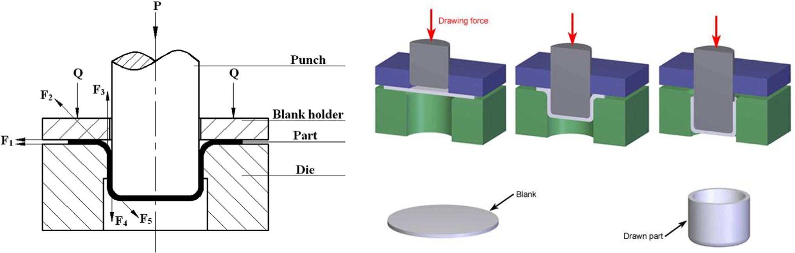
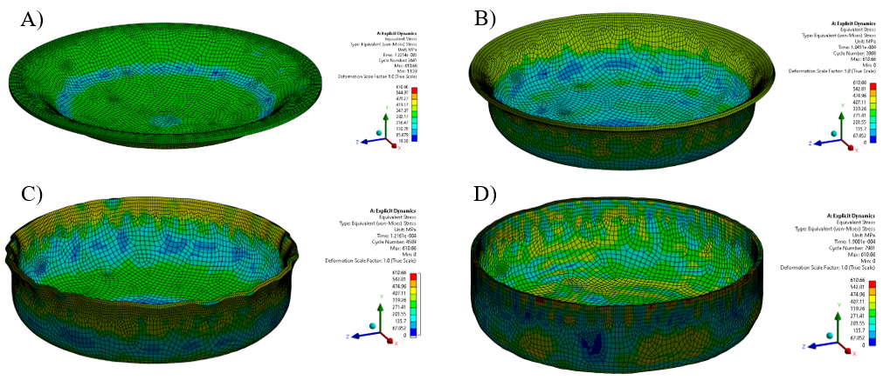

# Explicit Dynamics: Deep Drawing Process Simulation

**Engineer:** Bishoy Labib | **Type:** Nonlinear Finite Element Analysis (FEA) | **Solver:** Ansys Explicit Dynamics

This project simulates the manufacturing process of deep drawing an aluminum blank into a cylindrical cup. Using Explicit Dynamics, the full study analyzes the stress distribution, plastic strain, and deformation behavior of the material. A key focus of this project was the simulation of manufacturing defects as well, such as tearing, wrinkling, and earing—by manipulating process parameters like punch velocity and friction.

## 🎯 Objective
The primary goal was to create a realistic 3D simulation of the deep drawing process to:
1.  Analyze **Total Deformation** and **Equivalent (Von-Mises) Stress**.
2.  Validate the model using a **Mesh Convergence Study**.
3.  Simulate and identify common manufacturing defects (Tearing, Earing, Wall Wrinkling).

## ⚙️ Simulation Setup

### 1. Geometry & Parts

### 2. Material Properties
* **Material:** Aluminum (General Non-linear & Explicit).
* **Constitutive Model:** Bilinear Isotropic Hardening.

## 🔍 Mesh Convergence Study
To ensure the accuracy of the results independent of the mesh size, a convergence investigation was performed.
* **Strategy:** The blank mesh density was varied while tracking the Maximum Equivalent Stress and Computation Time.

## 📊 Results

### Equivalent (Von-Mises) Stress
The simulation captured the stress variations throughout the drawing phases.
* **Average Stress:** ~400 MPa.
* **Maximum Stress:** 610.66 MPa (occuring at critical deformation points).

### Plastic Strain
* **Max Plastic Strain:** 0.3986.
* This value remained below the failure strain for the successful drawing iteration, indicating a safe manufacturing process.

## 🚀 Conclusion
The simulation successfully validated that the deep drawing process for this specific aluminum grade is feasible under controlled friction and velocity parameters. The study highlighted the critical importance of mesh sizing in explicit dynamics, where a balance between element thickness (for bending accuracy) and Courant number (time step size) must be maintained.

---
*Based on the report "Explicit Dynamics Report – Deep Drawing" by Bishoy Labib.*
